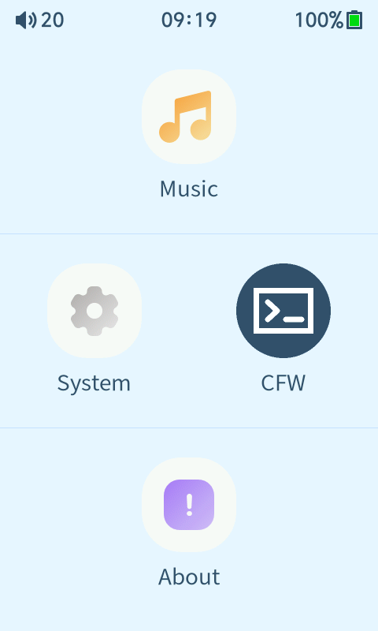
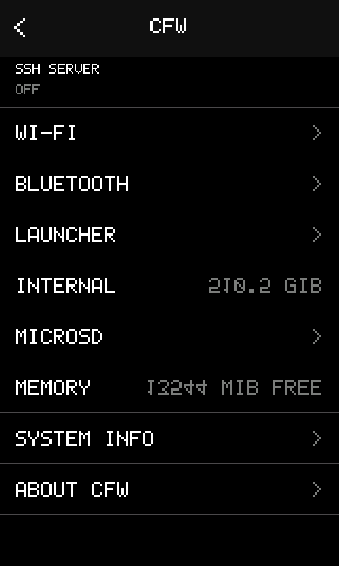
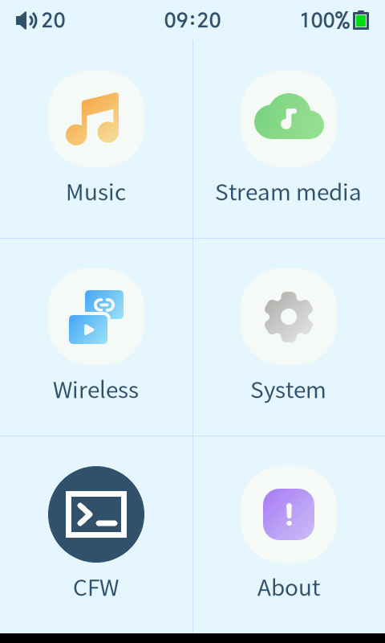

# HiBy R1 firmware 1.6 reverse engineering and CFW tools

This repository contains a reproducible analysis of the HiBy R1 `r1.upt`
firmware, tools to unpack and rebuild it, resource-export helpers, a diagnostic
overlay, Dropbear SSH support, and an experimental launcher/CFW application.
The stock input is never modified in place and firmware images are intentionally
excluded from Git.

## Current status

- The ISO/OTA container, chained chunks, MD5 manifests, SquashFS, and U-Boot
  `xImage` CRCs are validated during unpacking.
- SquashFS can be extracted with metadata, modified with reviewable overlays,
  rebuilt with the stock LZO geometry, packed, and re-extracted for verification.
- `export-assets` exports all loose `/usr/resource` files and the three current
  boot splashes, plus a SHA-256/geometry manifest.
- Dropbear 2026.94 is reproducibly cross-compiled for MIPS32r2 little-endian,
  o32 hard-float, and glibc 2.22. Its highest referenced glibc symbol version is
  2.19.
- Public-key and password SSH logins have passed an end-to-end QEMU user-mode
  test against the R1 rootfs. Full X1600 board emulation is not available.
- The stock LiteGUI layouts can be linted, rendered, and inspected without
  losing their repeated JSON-like widget keys. All 438 firmware 1.6 layouts
  parse successfully.
- The real proprietary `hiby_player` reaches its 480×800 UI under qemu-user
  through emulator-only framebuffer, HGL DMA, evdev touch, alignment, SD, and
  `sys_server` adapters. A safe navigator records curated UI smoke artifacts.
- CFW 0.1 uses 41 deterministic launcher configurations per stock theme, one
  guarded runtime route, and an independent MIPS sidecar. The default `0x71`
  mask shows Music, System, CFW, and About. CFW stays visible, four through six
  tiles are supported, and every optional stock tile can be restored after
  disabling another tile. Seven-tile scrolling is deferred to v0.2.
- The CFW sidecar controls SSH through the existing controller, reports live
  storage/RAM/system data, persists launcher visibility, and routes Wi-Fi and
  Bluetooth to the preserved stock Wireless hub.
- The v0.1 release pipeline prepares and independently re-extracts a candidate,
  normalizes ISO/Rock Ridge timestamps for byte-reproducible output, and refuses
  to publish without candidate-bound QEMU PASS evidence.
- The first SSH lab image has booted on physical R1 hardware and its immutable
  files were matched against the locally re-extracted build. The newer toggle
  image is still treated as experimental until it completes the same cold-boot
  test.

See [firmware-1.6-analysis.md](docs/firmware-1.6-analysis.md) for the complete
anatomy, [cfw-guide.md](docs/cfw-guide.md) for build/test/recovery notes, and
[ui-emulation.md](docs/ui-emulation.md) for static and real-player UI testing.

## Firmware anatomy

```text
r1.upt (ISO-9660)
├── ota_config.in
└── ota_v0/
    ├── ota_update.in
    ├── ota_md5_xImage.<whole-image-md5>
    ├── xImage.0000.<whole-image-md5>
    ├── xImage.0001.<previous-chunk-md5>
    ├── ...
    ├── ota_md5_rootfs.squashfs.<whole-image-md5>
    └── rootfs.squashfs.NNNN.<chained-md5>

xImage             U-Boot uImage, Linux 4.4.94+, MIPS32, Ingenic X1600
rootfs.squashfs     SquashFS 4.0 LE, LZO, 128 KiB blocks, glibc 2.22
```

The updater does not expose a cryptographic firmware signature check. Its MD5
chain and uImage CRC32 fields detect corruption but do not authenticate the
publisher. Hardware capture corrected an earlier assumption: `kernel2` and
`rootfs2` are a smaller recovery system, not a second full-size main-OS slot.
The recovery updater writes the 45 MiB main rootfs and returns the boot marker
to `ota:kernel` after success.

## Quick start

System requirements for the base tools are Python 3, `7z`, `unsquashfs`,
`mksquashfs`, and `genisoimage`. The QEMU SSH test also uses `socat`, OpenSSH,
OpenSSL, and `setsid` from util-linux.

```bash
python3 tools/r1fw.py unpack r1.upt work/original
python3 tools/r1fw.py inspect-kernel work/original/images/xImage
python3 tools/r1fw.py extract-rootfs \
  work/original/images/rootfs.squashfs work/rootfs

# Export the stock splash, all loose UI resources, and a manifest.
python3 tools/r1fw.py export-assets work/rootfs work/exported-assets

# Replace all three boot-splash variants with a validated 480x800 JPEG.
python3 tools/r1fw.py install-splash work/rootfs splash.jpg
```

To reproduce the SSH lab CFW:

```bash
tools/bootstrap-ssh-toolchain.sh
tools/build-dropbear-r1.sh
tools/test-dropbear-qemu.sh
tools/build-ssh-cfw.sh
```

The resulting local artifact is `dist/r1-cfw-ssh-toggle-1.6.upt`. The About page
shows `HiByR1 1,6 CFW`, and Developer Options contains an independent
**SSH server** switch. Both Developer Mode and that switch must be on; Dropbear
then follows the current Wi-Fi IPv4 address on port 2222. A fresh installation
defaults to off, while an upgrade from the earlier lab build preserves its
enabled state so it does not unexpectedly remove the recovery channel.
The validated artifact is 41,846,784 bytes with SHA-256
`a723cc8b851fb06b5d0b88ee81da24d500c4f8b69394ff156a6c677e11f4bbd9`.

Connect to the displayed Wi-Fi IP on port 2222:

```bash
ssh -p 2222 root@R1_WIFI_IP
```

The lab password is `hibyr1`. It is intentionally weak and must only be used on
a trusted test network. Public keys in `/usr/data/dropbear/authorized_keys` are
preferred.

For emergency recovery, an empty `CFW_SSH_ENABLE` file in the microSD root
temporarily overrides both UI gates. Remove it after access is restored.

### Experimental launcher/CFW v0.1

Build the prerequisite Dropbear binary, then prepare a release candidate:

```bash
tools/bootstrap-ssh-toolchain.sh
tools/build-dropbear-r1.sh
tools/build-cfw-0.1.sh prepare r1.upt
```

`prepare` verifies the exact stock 1.6 UPT SHA-256, works in a separate tree,
keeps `xImage` byte-identical, enforces the 45 MiB rootfs limit and strict
rootfs allowlist, packs the candidate, and re-extracts it for independent
verification. It deliberately does not create the final `dist/` artifact.

After the candidate completes the documented QEMU matrix and its validation
tool emits a PASS manifest bound to that exact rootfs, publish it with:

```bash
tools/build-cfw-0.1.sh publish r1.upt
sha256sum dist/r1-cfw-0.1-experimental.upt
```

Publication fails closed for missing, unsuccessful, malformed, or stale QEMU
evidence. The current gated local artifact passed all 24 mandatory checks:

```text
dist/r1-cfw-0.1-experimental.upt
SHA-256: ebf38f188d666ab258b1805c2517df7f2bbdc67e753d017f877afffd419f5022
```

Its exact validated SquashFS SHA-256 is
`4e070c5c6a78ece098179503b896da5ef098acc3616459a8c6062976377a3bb5`.
Generated firmware remains untracked. See
[cfw-guide.md](docs/cfw-guide.md) and
[launcher-research.md](docs/launcher-research.md) for the architecture, exact
launcher mapping, validation workflow, and remaining hardware-only risks.

### QEMU UI gallery

These are real 480×800 framebuffer captures from the exact candidate-bound
24-check qemu-user PASS. They are emulator evidence only, not proof of behavior
on physical hardware. CFW v0.1 supports four through six visible launcher
tiles, deliberately has no launcher scrolling, and rejects a seventh tile.

| Default compact launcher (`0x71`) | CFW main | Six-tile launcher (`0x77`) |
| --- | --- | --- |
|  |  |  |

These commands only construct and validate local files. They do not flash a
player, write an MTD device, alter the kernel/recovery image, or install the
candidate on physical hardware.

## UI research lab

Render and inspect the stock external resources:

```bash
python3 tools/r1ui.py lint work/r1-1.6/rootfs
python3 tools/r1ui.py serve work/r1-1.6/rootfs --port 8765
```

Run the real stock UI and open its local mouse-as-touch viewer in a second
terminal:

```bash
tools/run-r1-ui-qemu.sh

python3 tools/r1-qemu-ui/bridge.py serve \
  work/gui-qemu/runtime/framebuffer.raw \
  work/gui-qemu/runtime/touch/event0 \
  --state work/gui-qemu/runtime/frame-state.bin
```

If the ignored `misc/test-audio.mp3` fixture is present, the runner copies it
into the disposable simulated SD. The curated navigator can review or run a
non-destructive route through every launcher branch and that audio file:

```bash
python3 tools/r1-qemu-ui/navigate.py smoke --dry-run
python3 tools/r1-qemu-ui/navigate.py smoke
```

This is application-level qemu-user emulation, not a virtual X1600 board. DAC,
radio, USB, update, and recovery behavior still require physical hardware.

## CI

`.github/workflows/ci.yml` runs for pushes to every branch and for pull requests.
It checks Python and POSIX shell syntax, runs unit tests, performs a complete
synthetic `.upt`/SquashFS round trip, and rejects accidentally committed firmware
or `work/` trees. Proprietary stock firmware is not required by CI.

## Known limits

The OTA wrapper, Linux boot chain, filesystem, init scripts, physical MTD map,
and main/recovery update roles are characterized. `hiby_player` remains a
proprietary stripped MIPS executable; its external assets and integration points
are inventoried, but this repository does not claim a complete source-level
reconstruction. Installed bootloader behavior and failure recovery still need
more hardware testing before kernel, module, MTD, or bootloader experiments are
reasonable.
